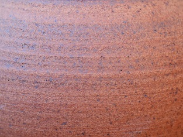
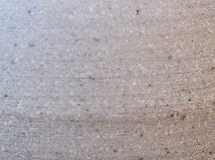
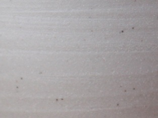
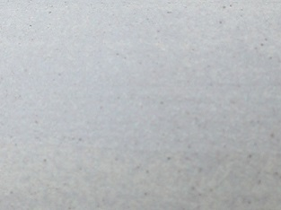
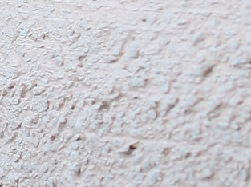
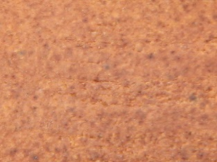
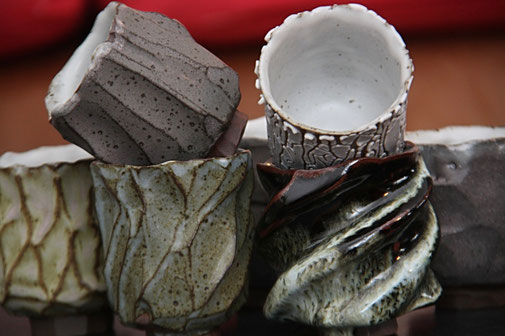
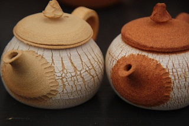

# Making tea pottery for you is my job

<iframe width="560" height="315" src="https://www.youtube.com/embed/3W9g7_UAsrc" title="YouTube video player" frameborder="0" allow="accelerometer; autoplay; clipboard-write; encrypted-media; gyroscope; picture-in-picture" allowfullscreen></iframe>

JI dedicate my work to the field of tea. I explore it through daily practice, so that the experience is transformed into concrete and useful qualities for the pieces. I handcraft all styles of teapots, but also kettles, braziers, tea jars, tea bowls... with a sense of detail and the pleasure of precision, so that you can fully enjoy your "tea moments".

The road I have travelled is magnificent, both in terms of the material and the human aspect. The road ahead is inspiring, full of promise and mystery. I embark on it with serenity and desire.
Thank you to all of you who trust me. With all my enthusiasm.
Jé

## The clays I used

### Treigny stoneware

This is a natural clay that comes from Burgundy. It is rather hard (2.5% porosity) and will tend to round out the flavours of the tea slightly. Treigny sandstone contains 3.33% iron oxide. This is why, once fired, the pieces take on this brown colour. I use this clay to make teapots, kyusu, hohin, shiboridashi, small tea jars.

### St Amand stoneware

St Amand stoneware is a natural clay, produced in the "Puisaye" region of Burgundy. This clay is relatively dense: 0.9% porosity. Once fired, it takes on a greyish appearance, similar to certain pebbles that can be found on the beaches of Normandy. I use this clay to make teapots, kyusu, hohin, shiboridashi.

### Porcelain stoneware

This is a white stoneware made with kaolin. The addition of kaolin gives it some of the properties of porcelain, including hardness, since the porosity of this clay is 0%. I use this clay to make teapots, kyusu, hohin, shiboridashi.

### "120.7" stoneware

This clay is mined in the Westerwald region of Germany by a company with over 200 years of experience in clay mining. It is very pleasant to work with and of high quality. It is a fireclay that I use for making kettles.

### Baillet clay

This is a clay known for its resistance to thermal shocks. It has been manufactured in the centre of France for over 100 years. This clay is mainly used by glassmakers in the manufacture of crucibles. Personally, I use it to make braziers.

### GECH30 clay

This is a very soft reconstruction sandstone (6.5% porosity). The oxides of which it is composed are: iron 4.65% and titanium 1.42%. When fired, this clay takes on a reddish colour and a slightly rough appearance. I use this clay to make tea jars for the conservation of puerh and red teas.

## My glazes

The search for glazes is an important part of my work. Although the raw clay serves the teapots in an interesting way, I like to use glazes to make the pieces unique. The glaze is an important part of the intention and character I want to give to a piece.
I am looking for a rendering as lively as possible. I mainly use vine and oak ash as raw materials. Each glaze is the result of specific research. All my glazes respect the regulations on materials in contact with foodstuffs.

## Firing

In ceramics, the firing method has a huge influence on the rendering of the pieces.
Just like shaping or glazing, firing is an area that requires experience. It is the last step that leads to the finished piece.
As far as I am concerned, I take advantage of each firing to deepen my knowledge in this field and to continue my research...
I use a gas kiln, and fire in a reducing atmosphere, that is to say, from 950°C I will reduce the presence of oxygen in the kiln. This phenomenon will ask the flames to come and look for the oxygen they need to survive inside the clay.
The result of this process is a more lively, less uniform finish on the pieces. The glazes will show different shades from one piece to another, and the clay will have a more pronounced character.

On the left a teapot fired in an oxidising atmosphere, and on the right a teapot fired in a reducing atmosphere.
It is the same clay!