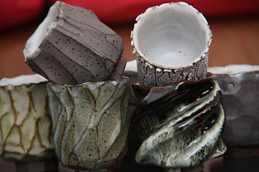

# Fabriquer pour vous des ustensiles à thé est mon travail

<iframe width="560" height="315" src="https://www.youtube.com/embed/3W9g7_UAsrc" title="YouTube video player" frameborder="0" allow="accelerometer; autoplay; clipboard-write; encrypted-media; gyroscope; picture-in-picture" allowfullscreen></iframe>

Je consacre mon travail au domaine du thé. Je l'explore par une pratique quotidienne, pour que l'expérience se transforme en qualités concrètes et utiles pour les pièces. Je fabrique artisanalement tous les styles d'infuseurs, mais aussi, des bouilloires, des brasero, des jarres à thé, des bols à thé... avec le sens du détail et le plaisir de la précision, pour que vous puissiez profiter pleinement de vos "instants thé".

Le chemin parcouru est magnifique, tant sur le plan de la matière que sur le plan humain. Le chemin qui reste à parcourir est inspirant, plein de promesses et de mystères. Je m'y engage avec séreux et envie.
Merci à vous qui me faites confiance. Avec tout mon enthousiasme.
Jé

## Les terres utilisées pour les théières artisanales

### Le grès de Treigny

Il s'agit d'une terre naturelle qui vient de Bourgogne. Elle est plutôt dure (2,5% de porosité) et aura tendance à légèrement arrondir les saveurs du thé. Le grès de Treigny contient 3,33% d'oxyde fer. C'est pour cette raison, qu'une fois cuitent, les pièces prennent cette teinte brune. J'utilise cette argile pour fabriquer les théières, les kyusu, les hohin, les shiboridashi, les petites jarres à thé.

### Le grès de St Amand

Le grès de St Amand, est une argile naturelle, produite dans la région de "Puisaye ", en Bourgogne. Cette argile est relativement dense : 0,9% de porosité. Une fois cuite, elle prend un aspect grisé, proche de certains galets que l'on peut trouver sur les plages Normandes. J'utilise cette argile pour fabriquer les théières, les kyusu, les hohin, les shiboridashi.

### Le grès porcelainique

Il s'agit d'un grès blanc fabriqué à base de kaolin. cet ajout de kaolin lui confère quelques unes des propriétés de la porcelaine et notament la dureté, puisque la porosité de cette argile est de 0%

### Le grès "120.7"

Cette argile est extraite dans la région de Westerwald en Allemagne, par une entreprise qui possède plus de 200 ans d'expérience dans l'exploitation des argiles. Elle est très agréable à travailler et d'une grande qualité. Il s'agit d'une argile réfractaire que j'utilise pour la fabrication des bouilloires.

### La terre de Baillet

Il s'agit d'une terre reconnue pour sa résistance aux chocs thermiques. Elle est fabriquée dans le centre de la France depuis plus de 100 ans. Cette terre est essentiellement destinée à l'usage des verriers, dans la fabrication des creusets. Personnellement, je la destine à la réalisation des brasero.

### la terre GECH30

Il s'agit d'un grès de reconstitution très tendre (6,5% de porosité). Les oxydes qui la composent sont : le fer 4,65% et le titane 1,42%. A la cuisson, cette terre prend une teinte rousse et un aspect légèrement rugueux. J'utilise cette terre pour la fabrication des jarres destinées à la conservation des puerh et des thés rouges.

## Mes émaux

La recherche d'émaux prend une place importante dans mon travail.
Bien que la terre brute serve de manière intéressante les théières, j'aime bien utiliser l'émail pour donner singularité aux pièces.
l'émaillage participe grandement à l'intention et au caractère que je souhaite donner à une pièce.
Je suis à la recherche d'un rendu le plus vivant possible.
J'utilise principalement de la cendre de vigne et de chêne comme matières premières
Chaque émail, est le fruit d'une recherche spécifique.
Tous mes émaux réspectent la réglementation sur les matériaux en contact avec les denrées alimentaires.

## La cuisson des théières artisanales en terre brute ou émaillées

Dans la céramique, le mode de cuisson influence énormément le rendu des pièces.
Tout comme le façonnage ou l'émaillage, la cuisson est un domaine à part entière, qui nécessite de l'expérience. C'est la dernière étape qui mène à la pièce finie.
En ce qui me concerne, je profite de chaque cuisson pour approfondir mes connaissances dans ce domaine et poursuivre mes recherches...
J'utilise un four à gaz, et cuis en atmosphère réductrice, c'est à dire, qu'à partir de 950°C je vais réduire la présence d'oxygène dans le four. Ce phénomène va demander aux flammes, de venir chercher à l'intérieur de la terre, l'oxygène dont elles ont besoin pour subsister.
Il résulte de ce procédé, un rendu plus vivant, moins uniforme sur les pièces. Les émaux vont montrer des nuances différentes d'une pièce à l'autre, et la terre aura un caractère plus prononcé.
